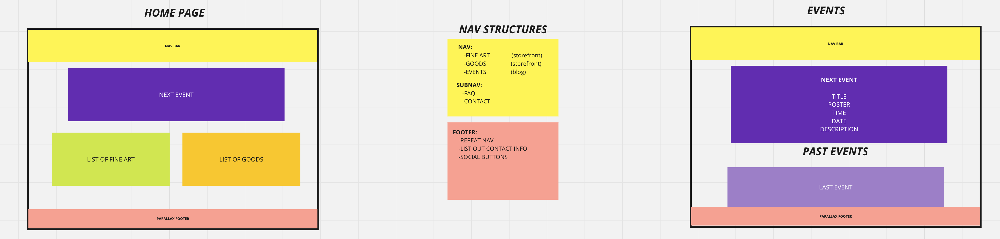
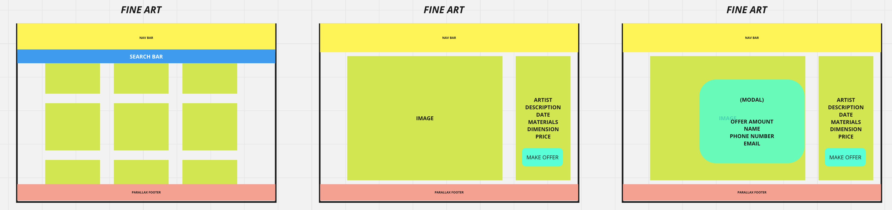
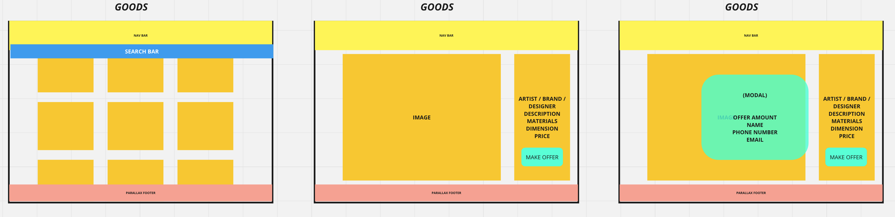

# GALLERY SITE

Since square footage is limited in the city, the site will function as the digital marketplace for a local gallery's small space and warehouse. To maintain the loose nature of the art world and to respect the ideals of the owner, the site will not function as a "cart- based" marketplace but one based on offers. The site will feature both fine art for hanging and a category we are calling goods (objects, furniture, etc). There will also be an events section to promote upcoming artist shows and features along with an archive for people to parouse through.

## WIREFRAMES

## LIST OF MODELS

### FINE ART
- artist
- description
- creation date(s)
- materials used
- dimensions
- price
- image

### ARTIST
- birth date
- about artist
- list of fine arts
- list of goods
- website link

### GOODS
- artist / brand / designer
- description
- materials used
- dimensions
- price
- image

### BRAND / DESIGNER
- about brand / designer
- list of goods
- website link

### EVENT
- title
- description
- poster
- time
- date
- (artist)
- (designer)

### OFFER
- (good)
- (fine art)
- offer amount
- name
- phone number
- email

## LIST OF STORIES

#### AS AN ADMIN...
- I will be able to edit when an event is added to the schedule
- when a piece of art or a good is added and when it is taken down (sold)

#### AS A USER...
- I will be able to search for art and goods on their respective search pages (live filter?)
-  I will be able to make an offer for an item

